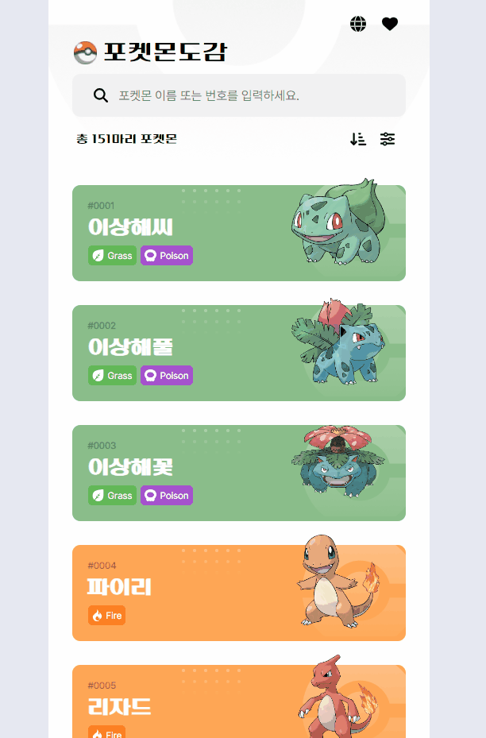
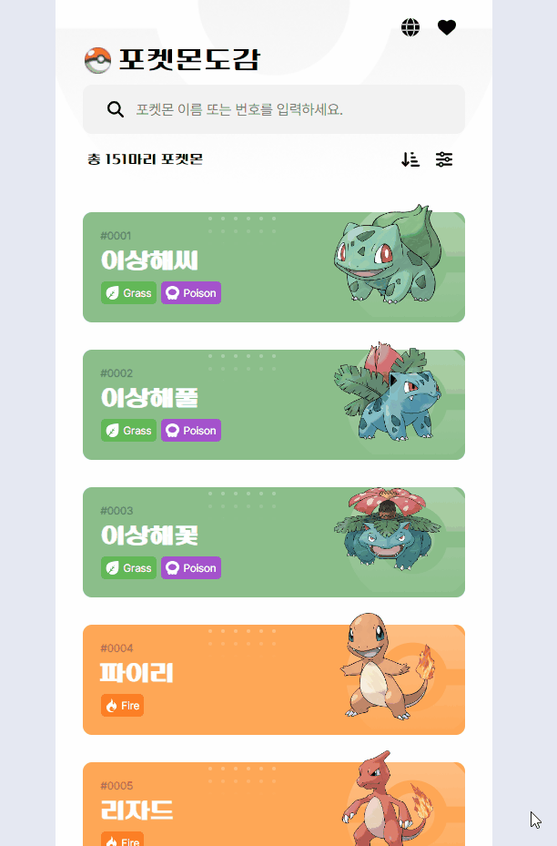
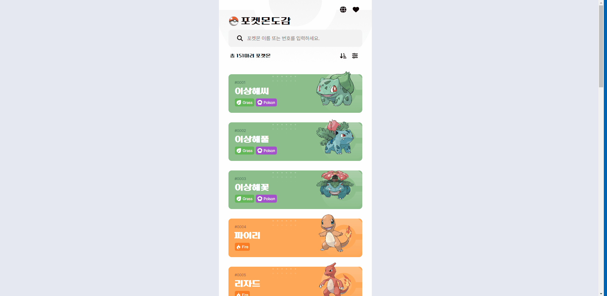

# 🐣 포켓몬 도감

**🚀 배포 링크**: [포켓몬 도감 바로가기](https://rigood.github.io/pokemon)

1세대 포켓몬(151종)을 조회, 검색, 정렬, 필터링할 수 있는 포켓몬도감 앱입니다.

 

|   포켓몬 검색 + 검색어 자동완성    |            포켓몬 상세정보             |
| :--------------------------------: | :------------------------------------: |
|  |  |

|            포켓몬 정렬             |            포켓몬 필터링             |
| :--------------------------------: | :----------------------------------: |
|  |  |

|             무한스크롤             |
| :--------------------------------: |
|  |

 

## 사용 기술

- react
- react-router-dom
- recoil
- styled-components
- i18next

 

## 주요 기능

- Promise.all을 사용하여 151개의 API 호출 병렬 처리
- recoil의 selector를 통해 Poke API로 받아온 데이터 캐싱
- React Suspense를 통해 비동기 데이터를 가져오는 동안 로딩 UI 렌더링
- Intersection Observer API를 활용하여 무한스크롤 구현
- recoil의 atom, selector를 이용하여 검색, 정렬, 필터링 기능 구현
- 검색어 자동완성 기능 구현
- React Portal을 이용하여 모달창 구현
- i18next 라이브러리를 사용하여 다국어(ko, en) 모드 구현
- My 포켓몬을 모아볼 수 있으며, localStorage에 데이터 저장

 

## 업데이트 기록

| **버전** |   **날짜**    |
| :------: | :-----------: |
|   2.1    | 2023. 11. 01. |
|   2.0    | 2023. 05. 28. |
|   1.0    | 2023. 01. 21. |

### 업데이트 예정

- Promise.all에 대한 에러 처리
- 포켓몬 Evolution 탭 만들기

### ver 2.1

- recoil의 selector를 통해 데이터를 캐싱
  - (기존) 메인화면이 마운트될 때마다 API 호출
  - (변경) 초기 앱 실행 시에만 API를 호출하고, 이후에는 캐싱된 데이터 사용
- 컴포넌트 분리, 폴더구조 변경 등

### ver 2.0

- 실시간 검색, 정렬, 필터 기능 추가

### ver 1.0

- 포켓몬 카드 조회 (fetch, poke API)
- 무한 스크롤 구현 (Intersection Observer API)
- 상세정보 모달창으로 띄우기 (React Portal)
